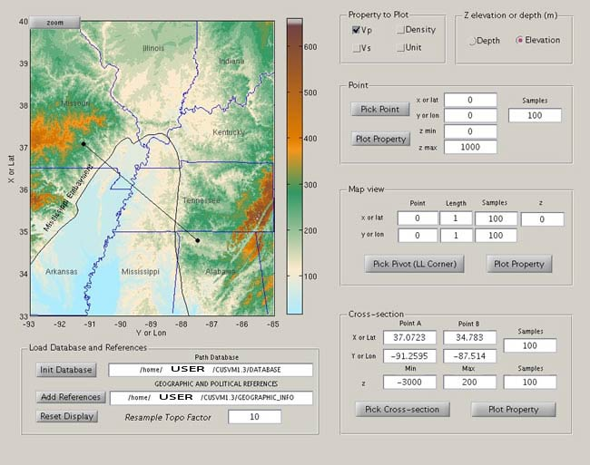

# MATLAB GUI
The GUI provided in this distribution (CUSVM Version 1.3) calls the code "geodataq" and takes advantage of the built in visualization capabilities of Matlab. It is intended to serve as a help to inspect the model.

Be sure that you have run compile_copy in the parent directory (GDDIR; for example, /home/user/cusvm) so that the query program is accessible to Matlab.

Open matlab and run:  

    cd GDDIR/GUI  
    geodataqgui  

Choose the DATABASE path (Init Database).  

Add GEOGRAPHIC_INFO references.  

Choose the type of query and the property to be displayed.  

